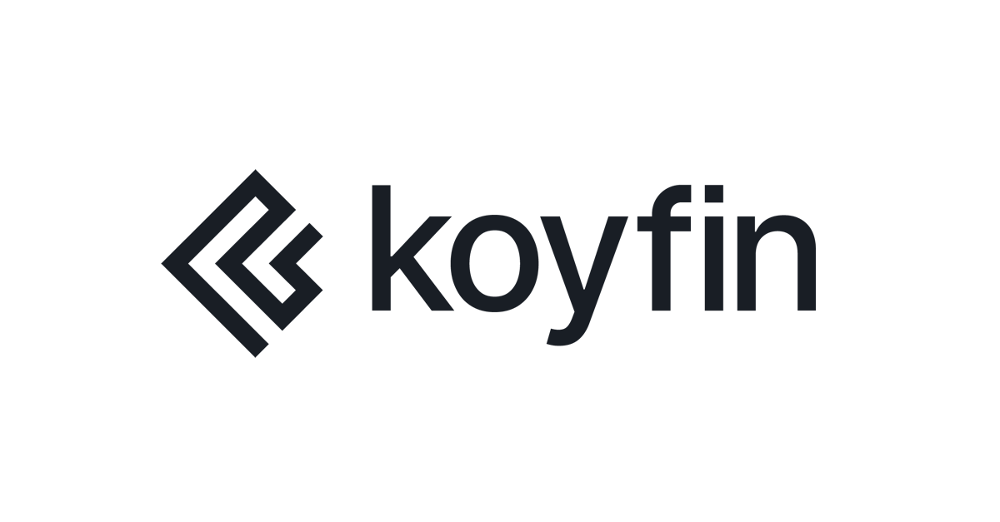

<a name="readme-top"></a>

<!-- PROJECT LOGO -->
<br />
<div align="center">
  <a href="https://github.com/gafzan/Koyfin">
    
  </a>

<h3 align="center">KoyfinBot</h3>
  <p align="center">
    A web bot launches koyfin.com, performs a screener and downloads the data automatically into csv files.
  </p>
</div>

<!-- TABLE OF CONTENTS -->
<details>
  <summary>Table of Contents</summary>
  <ol>
    <li>
      <a href="#about-the-project">About The Project</a>
    <li>
      <a href="#prerequisites">Prerequisites</a>
    </li>
    <a href="#installation">Installation</a>
    </li>
    <a href="#example">Example</a>
  </ol>
</details>


<!-- ABOUT THE PROJECT -->
## About The Project
This project is about automatizing parts of gathering data from [koyfin.com](https://app.koyfin.com/) while using their 
screener tool. Since the koyfin screener only displays data for the top 2000 stocks, in cases where you want to download 
data for more than that, this project allows you to break down the screening criteria in components to allow you to get 
all the data.

<p align="right">(<a href="#readme-top">back to top</a>)</p>


<!-- GETTING STARTED -->
### Prerequisites

This requires that you have at least a "Plus" koyfin membership since it allows you to download data (the free membership does not).

* Donwload [chromedriver](https://chromedriver.chromium.org/) and make sure that it is the same version as your Chrome browser

* You will need to store your koyfin.com credentials as well as the full path to your chromedriver.exe file as Environmental variables
  * Store *Chromedriver path* to variable name 'CHROMEDRIVER_FULL_PATH'
  * Store koyfin.com *email* to variable name 'KOYFIN_EMAIL'
  * Store koyfin.com *password* to variable name 'KOYFIN_PASSWORD'
 
 <p align="right">(<a href="#readme-top">back to top</a>)</p>
 
### Installation


1. Clone the repo
   ```sh
   git clone https://github.com/gafzan/Koyfin.git
   ```
2.  Install all required packages
      ```sh
      pip install requirements.txt
      ```
3. Enter your path to a folder that saves results in `config.py`
   ```
   KOYFIN_DATA_FOLDER_PATH = Path(r"...")  # TODO insert path to a save folder
   ```

<p align="right">(<a href="#readme-top">back to top</a>)</p>


<!-- USAGE EXAMPLES -->
### Example

As an example, let's say that we want to download data for all stocks in United States and Sweden that are either in the 
banking or energy industry (why not...?) we can set up a koyfinbot that does just that.

First step is to import what we need.
```
from automation.koyfinbot import KoyfinBot
```
Next is to create a dictionary with the criteria.
```
criteria = {
    'country': ['United States', 'Sweden'],
    'industry': ['Banks', 'Energy']
}
```
If we only needed data for Banks we could have defined the criteria as below:
```
criteria = {
    'country': ['United States', 'Sweden'],
    'industry': 'Banks'
}
```

Next we will setup the workflow for the KoyfinBot. We will create an instance of the object and login with our credentials.

```
bot = KoyfinBot()  # initialize an instance of a KoyfinBot object
bot.login()  # insert your credentials
```

Next to to the 'My Screens', add a new screen and specify our criteria by inputting the above dictionary in 
`add_universe_criteria()`
```
bot.go_to_my_screens()  # goes to the 'My Screens' page
bot.add_new_screen()
bot.name_screen(name='KoyfinBot demo')
bot.add_universe_criteria(criteria=criteria)
bot.run_screener()
```
Once we have our filtered universe of stocks, select the data view we will download.
```
bot.select_top_screen_view()  # the KoyfinBot will download the data seen in the top view under 'My Views'
bot.download_screener_result()  # the csv file will be stored under 'Downloads'
```

The entire script looks like this:
```
from automation.koyfinbot import KoyfinBot

criteria = {
    'country': ['United States', 'Sweden'],
    'industry': ['Banks', 'Energy']
}

bot = KoyfinBot()  # initialize an instance of a KoyfinBot object
bot.login()  # insert your credentials
bot.go_to_my_screens()  # goes to the 'My Screens' page
bot.add_new_screen()
bot.name_screen(name='KoyfinBot demo')
bot.add_universe_criteria(criteria=criteria)
bot.run_screener()
bot.select_top_screen_view()  # the KoyfinBot will download the data seen in the top view under 'My Views'
bot.download_screener_result()  # the csv file will be stored under 'Downloads'
bot.driver.close()
```

This script worked for simple sets of criteria. If we have more complex criteria where we need to have several 
dictionaries we can use the ``KoyfinDataDownloader`` class. This object downloads data according to several criteria configurations and
merges the data. Below is an example of an implementation where we want data for only bank stocks in United States and energy stocks in Sweden:

```
from automation.koyfinbot import KoyfinDataDownloader

criteria = [
    {
        'country': 'United States',
        'industry': 'Banks'
    },
    {
        'country': 'Sweden',
        'industry': 'Energy'
    }
]

bot = KoyfinDataDownloader(screen_criteria=criteria)
bot.download_data()
bot.save_data()
```
By default, the merged data will be saved in your downloads folder. You can change the save location 
by changing `KOYFIN_DATA_FOLDER_PATH` variable in `config.py`.
<p align="right">(<a href="#readme-top">back to top</a>)</p>
